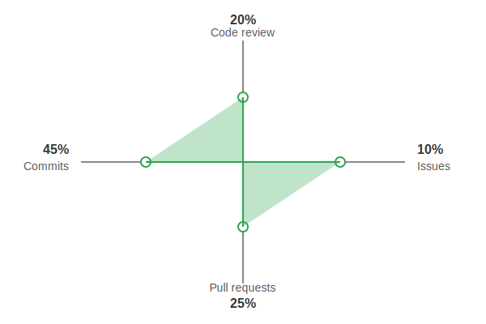

# 👋 Hi there, I'm Shraddha Jainak

## 🎓 About Me
Software Engineer passionate about building scalable applications and leveraging machine learning to solve real-world problems. Currently pursuing my Master's in Computer Science at University of Southern California.
- 🌱 I'm currently exploring **Multimodal Behavioral Analysis** and **Cloud-Native Development**
- 🔭 Working on advanced **Machine Learning** projects with focus on stress evaluation
- 💬 Ask me about **Full-Stack Development**, **ML/AI**, and **Cloud Technologies**
- 📫 How to reach me: shraddhajainak@gmail.com | (213) 675-0721

## 🛠️ Tech Stack

## 📊 GitHub Activity Overview

  <picture>
    <source media="(prefers-color-scheme: dark)" srcset="contribution-graph.svg">
    <source media="(prefers-color-scheme: light)" srcset="contribution-graph.svg">
    
  </picture>

## 📈 GitHub Stats

&nbsp;

